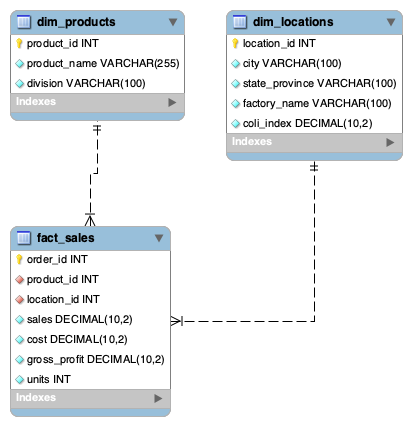

# Wonka Factory: Regional & Product Efficiency Audit

## Project Links
* **Trello Board:** [Wonka Chocolate Factory Workflow](https://trello.com/b/gyYgww4B/wonka-chocolate-factory)
* **Presentation:** [Final Audit Slide Deck](https://docs.google.com/presentation/d/1OZfa_wYFPTz2iJ7So95V7s_EN_i2zByNc2kBssobjnU/edit?usp=sharing)

## Team Members
* **Romina:** Data Architect (ETL, Python Cleaning, & Relational Database Design)
* **Monika:** SQL Analyst (Financial Queries & KPI Extraction)
* **Fiona:** Storyteller (Data Visualization & Presentation)

## Project Overview
This project is a comprehensive dual-threat audit of the Willy Wonka Chocolate Factory operations for the 2024-2025 fiscal period. Our analysis focuses on identifying operational waste in manufacturing and optimizing the product portfolio based on profit margins.

## Entity Relationship Diagram (ERD)

The final database follows a star-schema design:

- `fact_sales` stores transactional metrics.
- `dim_products` stores product attributes.
- `dim_locations` stores geographic and factory-related information, including COLI.

Relationships:
- `fact_sales.product_id` → `dim_products.product_id`
- `fact_sales.location_id` → `dim_locations.location_id`

## Key Findings

### 1. The "Texas Anomaly"
Our audit revealed a significant efficiency gap in Texas. Despite Texas having a lower Cost of Living Index (COLI) of 92.1 compared to coastal regions, specific factories are operating with extreme overhead:
* **Lot's O' Nuts (Texas):** Efficient at **$1.10 per unit**.
* **Secret Factory (Texas):** Inefficient at **$3.95 per unit** (nearly 4x the cost).
* **The Other Factory (Texas):** Inefficient at **$3.00 per unit**.

### 2. Product Performance
* **Money Makers:** The Chocolate division is the core profit driver.
    * *Top Performer:* **Wonka Bar - Scrumdiddlyumptious** ($18,350 total profit).
    * *Runner Up:* **Wonka Bar - Triple Dazzle Caramel** ($17,804 total profit).
* **Money Losers:** Low-margin items in the Sugar and "Other" divisions are barely breaking even.
    * *Bottom Performers:* **Fun Dip** ($4.80 total profit) and **Nerds** ($7.00 total profit).

### 3. Division Margins
* **Chocolate Division:** 67.45% Net Margin (Primary Revenue Driver).
* **Sugar/Other Divisions:** ~44% Net Margin.

## Final Recommendations
Based on the `wonka_master_analysis`, the factory should implement the following strategic changes:
1.  **Operational Optimization:** Immediately audit or consolidate the **Secret Factory** in Texas to eliminate high unit-cost waste.
2.  **Portfolio Management:** Phase out or re-price "Money Loser" products like **Fun Dip** and **Nerds** which consume resources with negligible return.
3.  **Growth Strategy:** Prioritize production and marketing for the **Scrumdiddlyumptious** line, particularly in high-COLI regions where current pricing effectively protects margins.

## Technologies Used
* **Python:** Data cleaning (Pandas) and High-Impact Visuals (Matplotlib/Seaborn).
* **SQL (SQLite/MySQL):** Relational database management and financial KPI extraction.
* **Trello:** Project management and Kanban workflow.
* **Google Slides:** Stakeholder presentation and storytelling.

## Data Sources

- Primary Dataset: Willy Wonka Chocolate Factory dataset.
- Secondary Dataset: U.S. Cost of Living Index (COLI) by State (2025).
